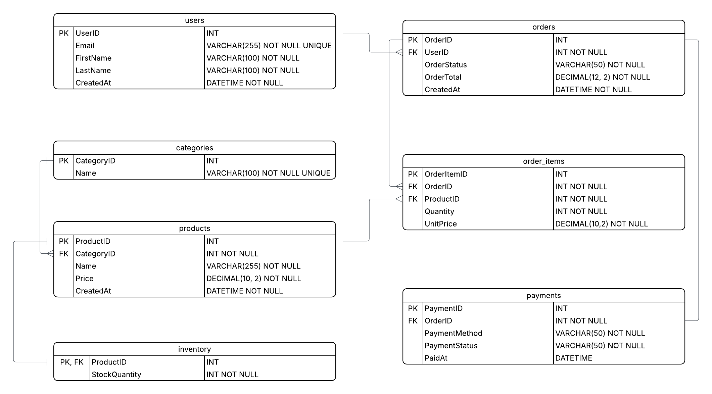

# E-Commerce Database & Analytics System

## Overview
This project implements a relational database system for a simplified, yet not too simple, e-commerce platform.  
The backend now includes a **RESTful API built with Node.js and Express** supporting transactional operations such as user management, product catalog, orders, payments, inventory updates, and **analytics** endpoints for business insights.

The database is designed to support both **transactional operations** and **analytical queries** (with queries for trends like revenue trends, customer behavior).  
The API focuses on **data integrity**, **query performance**, and **scalability**, enabling future front-end integration, if I desire to integrate such a feature.

---

## Problem Statement
Modern e-commerce systems must efficiently handle high volumes of transactional data whilst enabling meaningful business analytics. Poor designs of schema or lack of optimization can lead to data inconsistency, referential integrity issues, and slow queries as data volume grows. Furthermore, in worst cases, it can even lead to bad or inaccurate data, rather than just inconsistent.

The goal of this project is to design and implement a **normalized** relational database that:
1. Enforces data integrity
2. Accurately models real-world e-commerce relationships
3. Scales logically as data size and query complexity increase
4. Supports common analytical queries which could be used by businesses

---

## Schema Design Summary
The database schema is normalized and models the core properties involved in an e-commerce workflow, including:

- Users
- Categories
- Products
- Inventory
- Orders
- Order Items
- Payments

Key design decisions include:
- Use of a junction table (`order_items`) to model the many-to-many relationship between orders and products, showing good use of normal form
- Separation of inventory data from product metadata
- Explicit foreign key constraints to enforce referential integrity
- Use of surrogate primary keys for scalability and indexing efficiency

---
## RESTful API Endpoints

### Users
- `GET /api/users` — List all users  
- `GET /api/users/:id` — Get user details  
- `POST /api/users` — Create new user  

### Categories
- `GET /api/categories` — List categories  

### Products
- `GET /api/products` — List products with category and inventory info  
- `POST /api/products` — Create product with inventory initialization (transactional)  

### Orders
- `GET /api/orders/:id` — Retrieve detailed order with user, items, and payment info  
- `POST /api/orders` — Place new order (validates users, products, inventory, handles transaction, payments)  
- `GET /api/users/:id/orders` — List orders for a given user  

### Analytics
- `GET /api/analytics/total-revenue` — Total revenue from completed orders  
- `GET /api/analytics/monthly-revenue` — Revenue grouped by month  
- `GET /api/analytics/top-customers` — Customers ranked by total spend  
- `GET /api/analytics/top-products` — Best-selling products by quantity  
- `GET /api/analytics/revenue-by-product` — Revenue by product  

All POST endpoints include input validation and transactional safety to maintain consistency.

---

## Entity-Relationship Diagram


---

## Data Generation (Python)
A Python data generator is used to populate the database with realistic **AND** relationally valid data. The generator respects all foreign key dependencies and business rules by inserting data in dependency order.

### Generated Data Includes:
- Users with realistic names and emails (created using both faker and a specific format for unique emails which relate to names)
- Categorized products with unique model identifiers
- Inventory records for every product
- Orders linked to users
- Order items linked to both orders and products
- Optional payment records per order, as some might be pending payment

The product catalog is separated into its own module to improve **modularity**, **readability**, and **maintainability** of the data generation logic.

---

## Sample Analytics Queries
The database supports analytical queries such as:
- Total and monthly revenue
- Top customers by lifetime spend
- Best-selling products by quantity
- Revenue by category
- Average order value
- Low-inventory alerts
- Orders without associated payments

All queries are written using standard SQL and they also leverage joins, aggregations, and grouping operations for functional analytical queries.

---

## Project Structure
```
ECommerceDBProject/
├── README.md
├── api
│   └── src
│       ├── app.js
│       ├── connection.js
│       ├── routes
│       │   ├── analytics.routes.js
│       │   ├── categories.routes.js
│       │   ├── orders.routes.js
│       │   ├── products.routes.js
│       │   └── users.routes.js
│       └── server.js
├── data
│   └── seed_data.sql
├── images
│   └── ER_diagram.png
├── python
│   ├── config.py
│   ├── data_generator.py
│   ├── db.py
│   ├── product_catalog.py
│   └── test_connection.py
├── queries
│   └── analytics.sql
├── schema
│   ├── constraints.sql
│   ├── create_tables.sql
│   └── indexes.sql
└── scripts
    ├── analytics.sql
    └── reset_db.sql
```


---

## Tech Stack
- MySQL / MariaDB  
- Node.js / Express (REST API)  
- SQL  
- Python (data generation)  
- Faker (for realistic data)  
- MySQL Workbench  
- Git / GitHub 

---

## Possible Future Expansions
Planned extensions to this project in the near future include:
- Expand API with full CRUD endpoints for all entities
- Add authentication
- Develop frontend UI for interaction and visualization

---

## Summary
This project demonstrates a full backend system combining relational database design, API development, and data analytics in an e-commerce context. It reflects patterns and best practices used in real-world scalable commerce applications.
